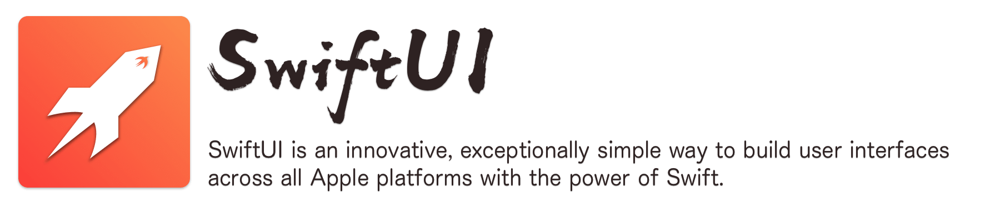

[](https://github.com/Jinxiansen/SwiftUI)
[](https://swift.org)
[](https://developer.apple.com/xcode)
[](https://developer.apple.com/macOS)
[](https://opensource.org/licenses/MIT)


This article refers to SwiftUI [apple example](https://github.com/Jinxiansen/SwiftUI/tree/doc) and records the results of the exploration here, I hope to be helpful to you.

For the content described in this article, by default you have some experience based on Swift language development, so it will not describe every detail in detail; if you have doubts about Swift syntax, you can learn [Swift](https://swift.org) Grammar.

When learning and using `SwiftUI`, if you have any questions, you can join the SwiftUI QQ Group: **18552966** to discuss communication.

[中文版🇨🇳](README_CN.md)

### ⭐️ Stargazers over time

[](https://starchart.cc/Jinxiansen/SwiftUI)

### 💻 Requirements

- macOS 15
- Xcode 11.0
- iOS 13.0


## Directory：

### Basic View

* <span id="Text_D">Text</span>
	- [Text](#Text)
	- [TextField](#TextField)
	- [SecureField](#SecureField)

* <span id="Image_D">Image</span>
	- [Image](#Image)
	- [WebImage](#WebImage)

* <span id="Button_D">Button</span>
	- [Button](#Button)
	- [PullDownButton](#PullDownButton)
	- [ItemBasedPopUpButton](#ItemBasedPopUpButton)
	- [NavigationButton](#NavigationButton)
	- [PresentationButton](#PresentationButton)
	- [EditButton](#EditButton)
	- [PasteButton](#PasteButton)

* <span id="Picker_D">Picker</span>
	- [Picker](#Picker)
	- [DatePicker](#DatePicker)
	- [Toggle](#Toggle)
	- [Slider](#Slider)
	- [Stepper](#Stepper)
	- [SegmentedControl](#SegmentedControl)

* <span id="Special_D">Special Views</span>
	- [WebView](#WebView)
	- [UIViewController](#UIViewController)

### <span id="Layout_D">Layout</span>
	
* <span id="Stacks_D">Stacks</span>
	- [HStack](#HStack)
	- [VStack](#VStack)
	- [ZStack](#ZStack)

* <span id="List_D">List</span>
	- [List](#List)
	- [ScrollView](#ScrollView)
	- [ForEach](#ForEach)

* <span id="Container_D">Container Views</span>
	- [Group](#Group)
	- [GroupBox](#GroupBox)
	- [Section](#Section)
  - [Form](#Form)

* <span id="Architectural_D">Architectural Views</span>
	- [NavigationView](#NavigationView)
	- [TabView](#TabView)
	- [HSplitView](#HSplitView)
	- [VSplitView](#VSplitView)

* <span id="Alert_D"> Alert </span>
	- [Alert](#Alert)
	- [Modal](#Modal)
	- [Popover](#Popover)
	- [Sheet](#Sheet)
	- [ActionSheet](#ActionSheet)


### <span id="State_D">State and Data Flow</span>

* <span id="Bindings_D"> Bindings </span>
	* [Binding](#Binding)

* <span id="Data_D"> Data-Dependent Views </span>
	* [State](#State)
	* [ObjectBinding](#ObjectBinding)
	* [EnvironmentObject](#EnvironmentObject)

* <span id="Environment_D"> Environment Values </span>
	* [Environment](#Environment)
	* [EnvironmentValues](#EnvironmentValues)

* <span id="ENavigation_D"> ENavigation Models </span>
	* [DynamicNavigationDestinationLink](#DynamicNavigationDestinationLink)

* <span id="Preferences_D"> Preferences </span>
	* [LocalizedStringKey](#LocalizedStringKey)

* <span id="Transactions_D"> Transactions </span>
	* [Transaction](#Transaction)


### <span id="Gestures_D">Gestures</span>

* <span id="BasicGestures_D"> Basic Gestures </span>
	* [TapGesture](#TapGesture)
	* [LongPressGesture](#LongPressGesture)
	* [DragGesture](#DragGesture)
	* [MagnificationGesture](#MagnificationGesture)
	* [RotationGesture](#RotationGesture)

* <span id="Combined_D"> Combined Gestures </span>
	* [SequenceGesture](#SequenceGesture)
	* [SimultaneousGesture](#SimultaneousGesture)
	* [ExclusiveGesture](#ExclusiveGesture)

* <span id="Custom_D"> Custom Gestures </span>
	* [AnyGesture](#AnyGesture)


<h2 id="Basic View">Basic View</h2>


<h4 id="Text">Text</h4>

`Text` is used to display one or more lines of text content with the same effect as `UILabel`, but it is even better.

If you want to create `Text`, just create it with `Text("SwiftUI")`;
With chained syntax, you can also add multiple attributes to the text, such as fonts, colors, shadows, spacing between top left and right, and so on.

Example:

```swift
Text("SwiftUI")
    .foregroundColor(.orange)
    .bold()
    .font(.system(.largeTitle))
    .fontWeight(.medium)
    .italic()
    .shadow(color: .black, radius: 1, x: 0, y: 2)
```

<details close>
  <summary>View running results</summary>
  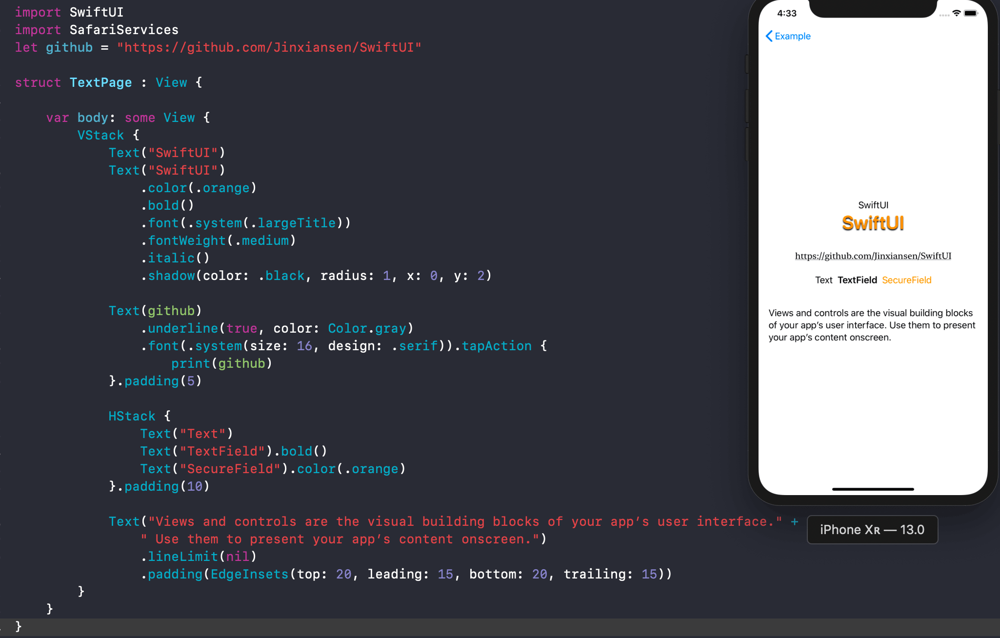
</details>

 
> HStack and VStack controls are used to host multiple views, as mentioned later.

[🔝](#Text_D)

<h4 id="TextField"> TextField </h4>
 
`TextField` is used to add a normal input box, which is often used as a text input.

Example：

```swift

TextField(self.$name, placeholder: self.nameText, onEditingChanged: { changed in
    print("onEditing: \(changed)")
}) {
    print("userName: \(self.name)")
    self.endEditing(true)
}}
.padding(10)
.frame(height: 50)
.textFieldStyle(RoundedBorderTextFieldStyle())
.padding(EdgeInsets(top: 0, leading: 20, bottom: 0, trailing: 20))

```

<details close>
  <summary>View running results</summary>
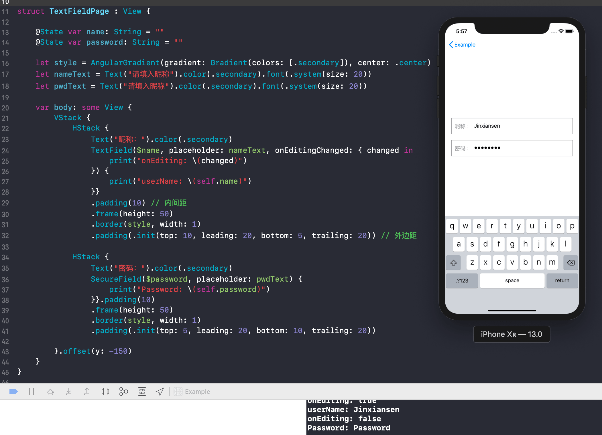
</details>

[🔝](#Text_D)

<h4 id="SecureField"> SecureField </h4>

`SecureField ` is generally used as a password input. It is used in the same way as `TextField`. The example and the running effect are the same as `TextField`.


<h4 id="Image"> Image </h4>

The `Image` control is used to display images, example:

```swift
Image("icon")
    .resizable()
    .frame(width: 100,
           height: 100,
           alignment: .center)
```

<details close>
  <summary>View running results</summary>
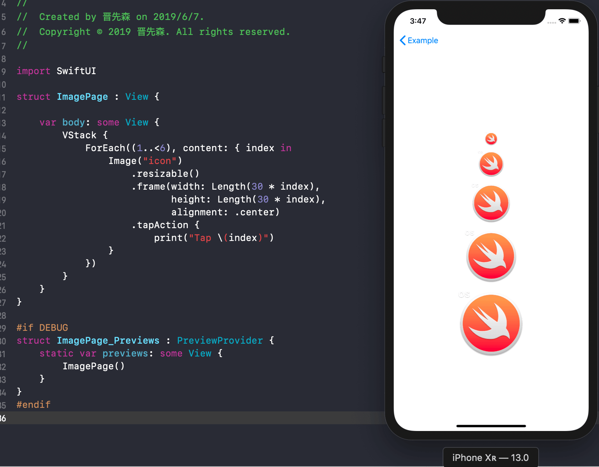
</details>

[🔝](#Text_D)

<h4 id="WebImage"> WebImage </h4>

`webImage` is used to download the web image, use the `URLSession` to download the original `Image` after successful download; you can also use [Kingfisher]((https://github.com/onevcat/Kingfisher)) in the `downloadWebImage ` function .

Example：

```swift
var body: some View {
        Image(uiImage: self.uiImage ?? placeholderImage)
            .resizable()
            .onAppear(perform: downloadWebImage)
            .frame(width: 80,
                   height: 80,
                   alignment: .center)
            .onTapGesture {
                print("Tap ")
        }
    }
```

<details close>
  <summary>View running results</summary>
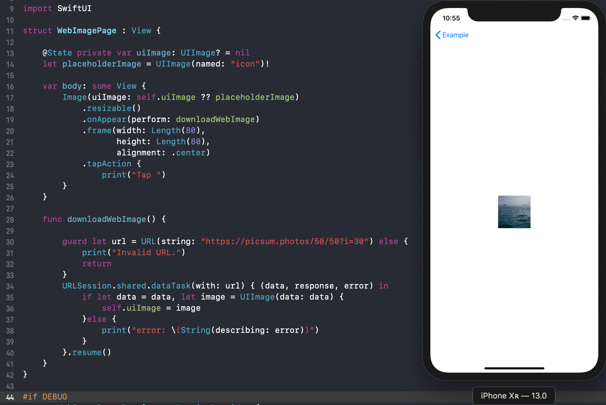
</details>

[🔝](#Text_D)

<h4 id="Button"> Button </h4>

`Button` is used to respond to click events.

Example:

```swift
Button(action: {
    print("Tap")
}) {
   Text("I'm a Button")
}
```
<details close>
  <summary>View running results</summary>
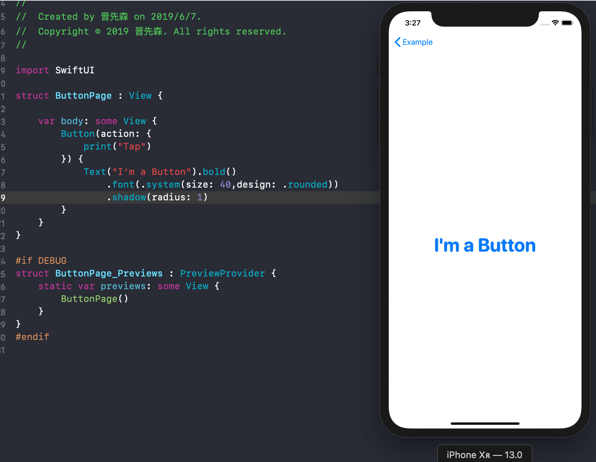
</details>

[🔝](#Button_D)

<h4 id="PullDownButton"> PullDownButton </h4>

Waiting for release.

<h4 id="ItemBasedPopUpButton"> ItemBasedPopUpButton </h4>

Waiting for release.


<h4 id="NavigationButton"> NavigationButton </h4>

`NavigationButtonPage ` is used to push to the next navigation page.

Example:

```swift
NavigationLink(destination: NavigationButtonPage()) {
            Text("NavigationButton").bold()
                .foregroundColor(.orange)
                .font(.largeTitle)
            }
    .navigationBarTitle(Text("Page"))
```     

<details close>
  <summary>View running results</summary>
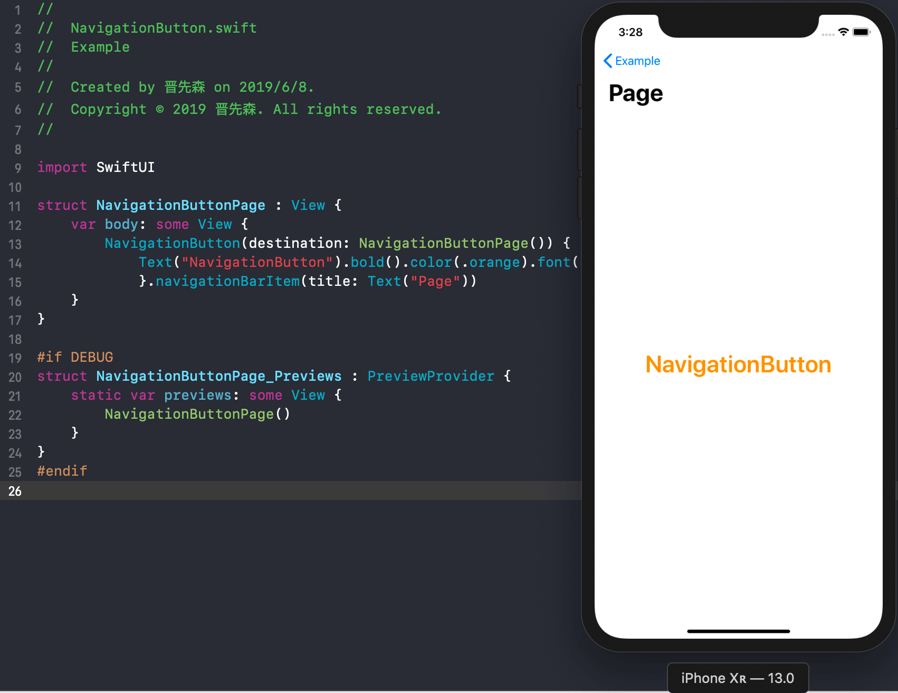
</details>

[🔝](#Button_D)

<h4 id="PresentationButton" style='color:red'> PresentationButton is deprecated</h4>

`PresentationButton` ~~is used to pop up a page.~~ has deprecated, please use `NavigationLink` 


[🔝](#Button_D)

<h4 id="EditButton"> EditButton </h4>

`EditButton` is used to trigger the editing state, just use the `navigationBarItems` setting when using it. 

Example:

```swift
navigationBarItems(trailing: EditButton())
```     

<details close>
  <summary>View running results</summary>
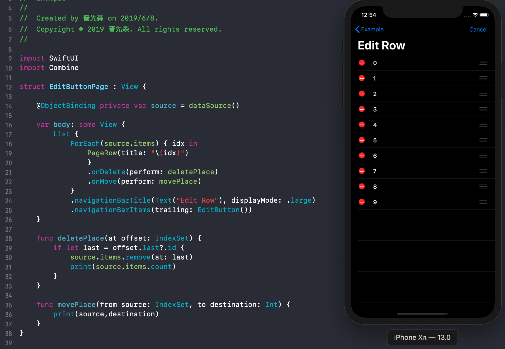
</details>

[🔝](#Button_D)

<h4 id="PasteButton"> PasteButton </h4> 

Waiting for release.
 

<h4 id="Picker"> Picker </h4>

`Picker` can customize the selector of the data source.

Example:

```swift
Picker(selection: $leftIndex, label: Text("Picker")) {
    ForEach(0..<leftSource.count) {
        Text(self.leftSource[$0]).tag($0)
    }
    }.frame(width: UIScreen.main.bounds.width/2)
```     

<details close>
  <summary>View running results</summary>
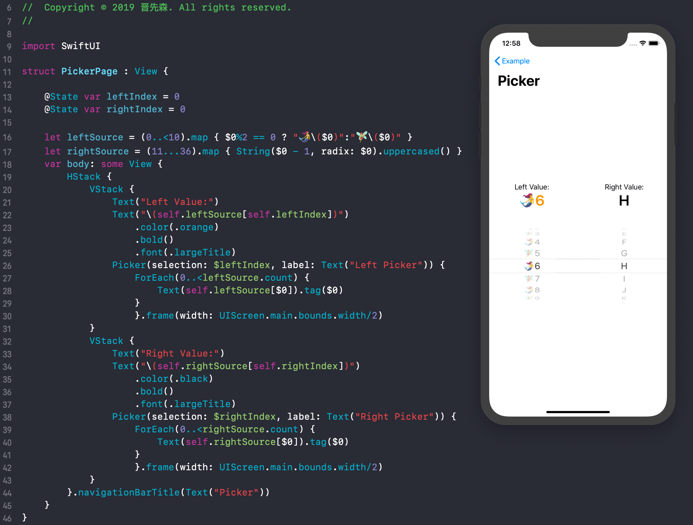
</details>

[🔝](#Picker_D)

<h4 id="DatePicker"> DatePicker </h4>

`DatePicker` is used to select the absolute date of the control.

Example:

```swift

                DatePicker(selection: $server.date, 
                in: server.spaceDate, 
                displayedComponents: .date, label: {
                    Text("")
                })
```     

<details close>
  <summary>View running results</summary>
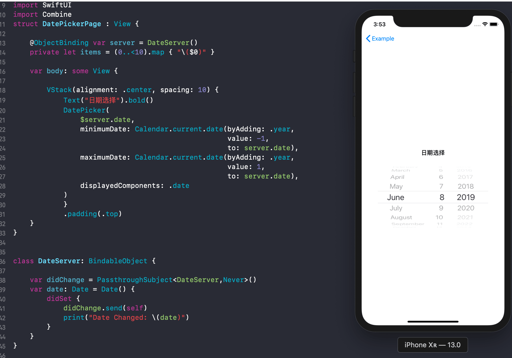
</details>

[🔝](#Picker_D)

<h4 id="Toggle"> Toggle </h4>

`Toggle` is used to switch the selected state, for example:

```swift
Togglele(isOn: $isOn) {
    Text("State: \(self.isOn == true ? "Open":"open")")
}.padding(20)
```

<details close>
  <summary>View running results</summary>
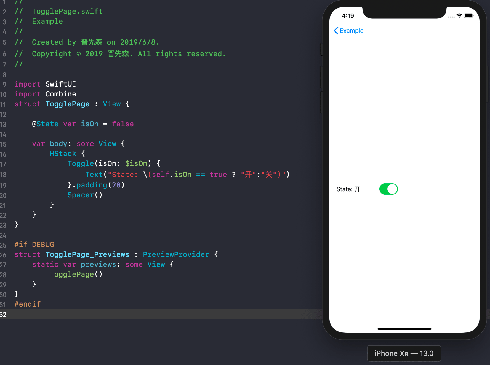
</details>

[🔝](#Picker_D)

<h4 id="Slider"> Slider </h4>

`Slider ` A control for selecting values from a finite range of values, example:

```swift
Slider(value: $data.rating)
```     

<details close>
  <summary>View running results</summary>
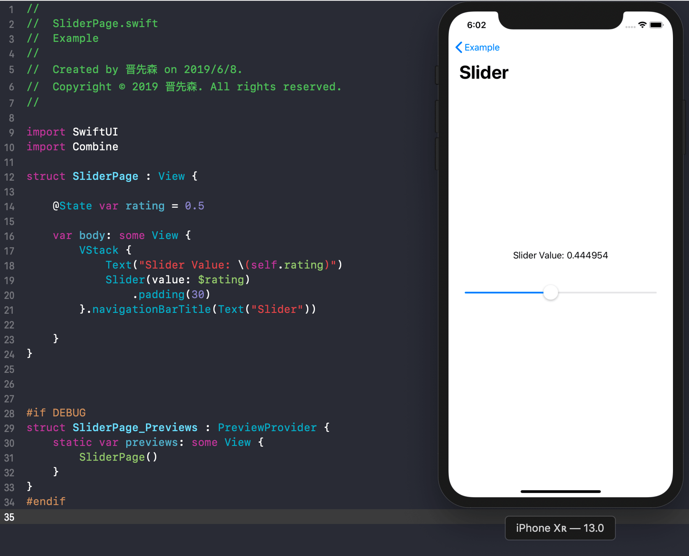
</details>
 
 [🔝](#Picker_D)

<h4 id="Stepper"> Stepper </h4>

`Stepper ` is used to increase or decrease the value, example:

```swift
Stepper(value: $value, step: 2, onEditingChanged: { c in
    print(c)
}) {
    Text("Stepper Value: \(self.value)")
    }.padding(50)
```

<details close>
  <summary>View running results</summary>
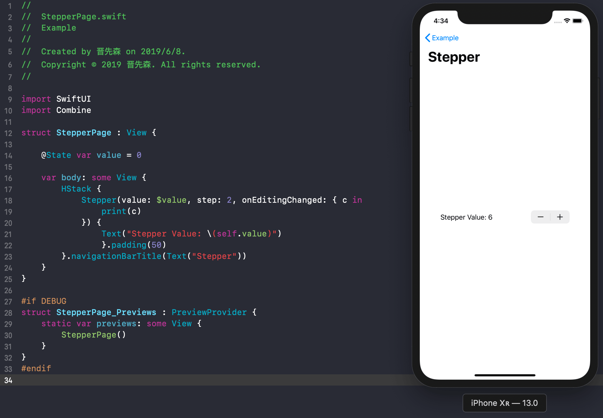
</details>

[🔝](#Picker_D)

<h4 id="SegmentedControl" style="color:red">SegmentedControl is deprecated</h4>

`SegmentedControl ` is used for segmentation condition selection, example:

```swift
SegmentedControl(selection: $currentIndex) {
    ForEach(0..<items.count) { index in
        Text(self.items[index]).tag(index)
    }
    }.tapAction {
        print("currentIndex: \(self.currentIndex)")
}
```

<details close>
  <summary>View running results</summary>
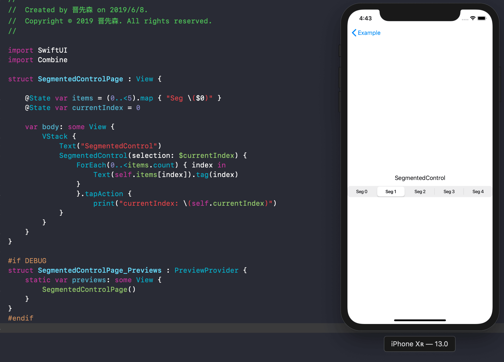
</details>

[🔝](#Picker_D)

<h4 id="WebView"> WebView </h4>

`WebView` is used to display an open web page, example:

```swift
struct WebViewPage : UIViewRepresentable {
    func makeUIView(context: Context) -> WKWebView  {
        return WKWebView()
    }
    func updateUIView(_ uiView: WKWebView, context: Context) {
        let req = URLRequest(url: URL(string: "https://www.apple.com")!)
        uiView.load(req)
    }
}
```

<details close>
  <summary>View running results</summary>
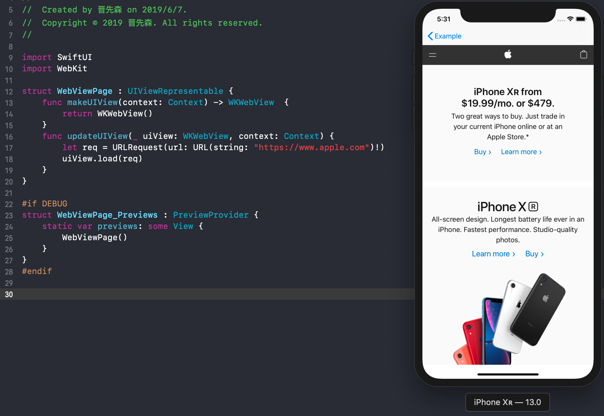
</details>

[🔝](#Special_D)

<h4 id="UIViewController"> UIViewController </h4>

`UIViewController` is used to display the **UIViewController** that opens **UIKit** in **SwiftUI** and opens the `SwiftUI` View in **UIViewController**.

Example:

First define:

```swift
struct ControllerPage<T: UIViewController> : UIViewControllerRepresentable {
    
    typealias UIViewControllerType = UIViewController
    
    func makeUIViewController(context: UIViewControllerRepresentableContext<ControllerPage>) -> UIViewController {
        return T()
    }
    
    func updateUIViewController(_ uiViewController: UIViewController, context: UIViewControllerRepresentableContext<ControllerPage>) {
        debugPrint("\(#function)：\(type(of: T.self))")
    }
    
}
```

Then use this:

```swift
NavigationButton(destination: ControllerPage<UIKitController>()) {
    PageRow(title: "UIViewController",subTitle: "Open UIViewController")

}
```


<details close>
  <summary>View running results</summary>
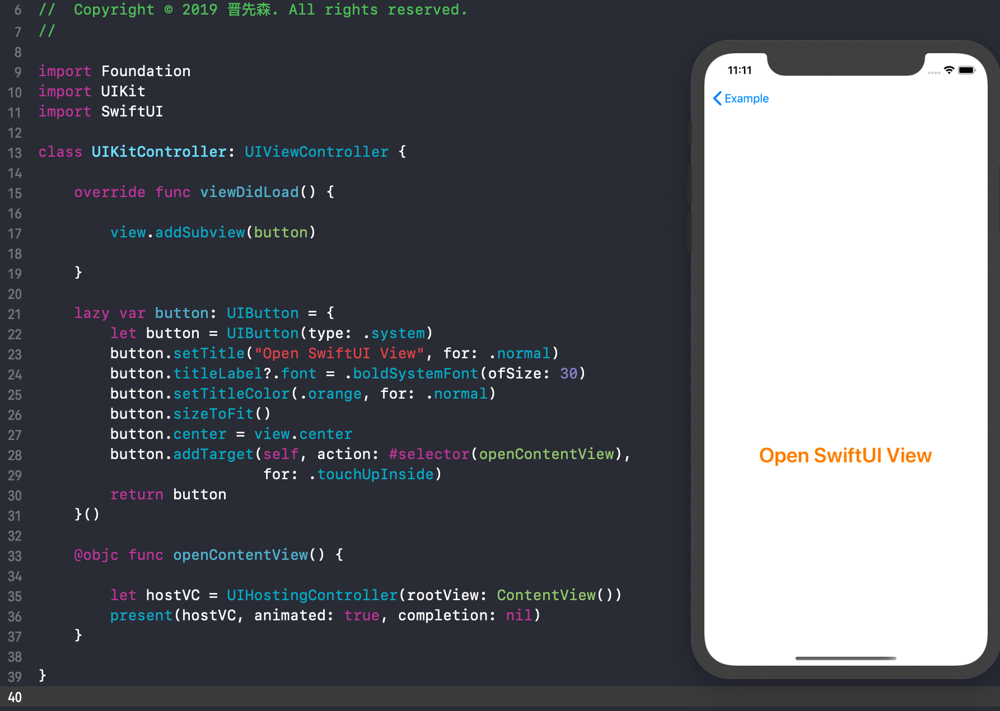
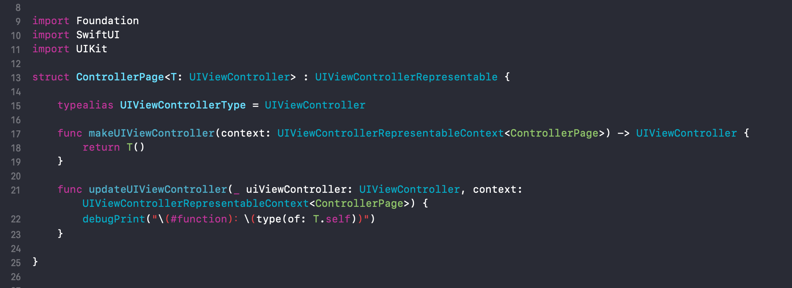
</details>

[🔝](#Special_D)


### Layout 


<h4 id="HStack"> HStack </h4>

`HStack` is used to arrange the subviews on a horizontal line. 

Example:

```swift
HStack {
    Text("made in China.")
    Divider() // Just add a line.
    Text("the People's Republic Of China.")
}
```

<details close>
  <summary>View running results</summary>
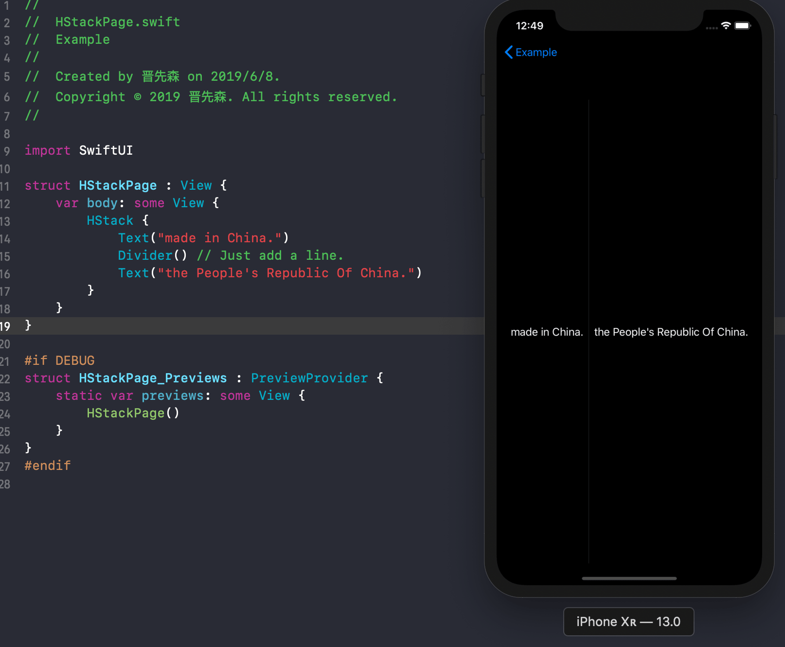
</details>

[🔝](#Layout_D)

<h4 id="VStack"> VStack </h4>

`VStack` is used to arrange the subviews on a vertical line.

Example:

```swift
VStack {
    Text("made in China.")
    Divider() // Just add a line.
    Text("the People's Republic Of China.")
}
```

<details close>
  <summary>View running results</summary>

</details>

[🔝](#Layout_D)

<h4 id="ZStack"> ZStack </h4>

`ZStack` is used to override the subview, aligned on two axes.

Example:

```swift
ZStack {
    Text("made in China.")
    Divider() // Just add a line.
    Text("the People's Republic Of China.")
}
```

<details close>
  <summary>View running results</summary>
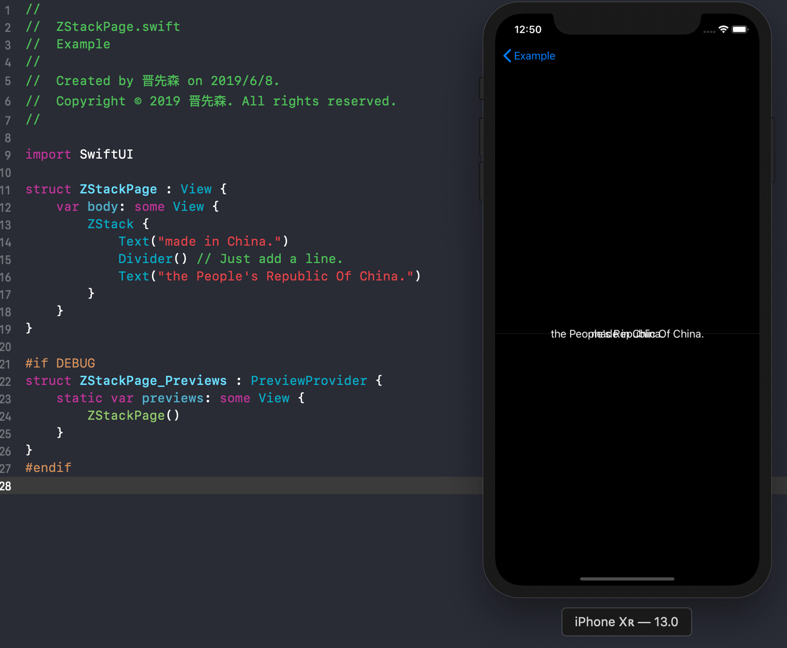
</details>

[🔝](#Layout_D)

<h4 id="List"> List </h4>

`List` list container to display a list of data.

Examples:

```swift
List(0..<5) { item in
    Text("Hello World !")
}.navigationBarTitle(Text("List"), displayMode: .large)
```

<details close>
  <summary>View running results</summary>
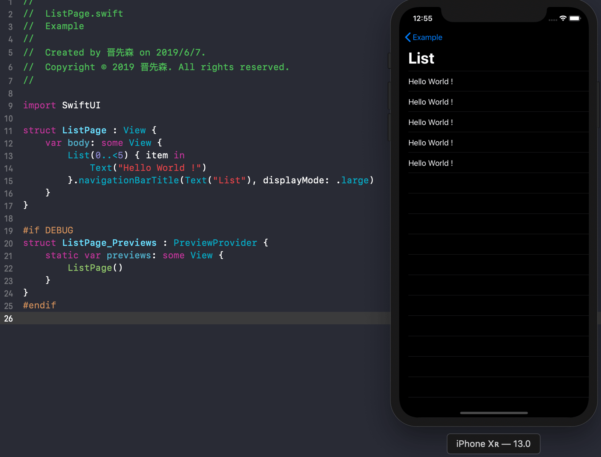
</details>

[🔝](#Layout_D)

<h4 id="ScrollView"> ScrollView </h4>

`ScrollView` is a scroll view container.

Example:

```swift
ScrollView {
    Text("SwiftUI").padding(20)
    Divider()
    Image("icon").resizable()
        .frame(width: 300, height: 300, alignment: .center)
    Divider()
    Text("Views and ... user interface.")
    }
    .border(Color.gray.gradient, width: 1)
            .cornerRadius(10)
            .padding(10)
            .navigationBarTitle(Text("ScrollView"))
```

<details close>
  <summary>View running results</summary>
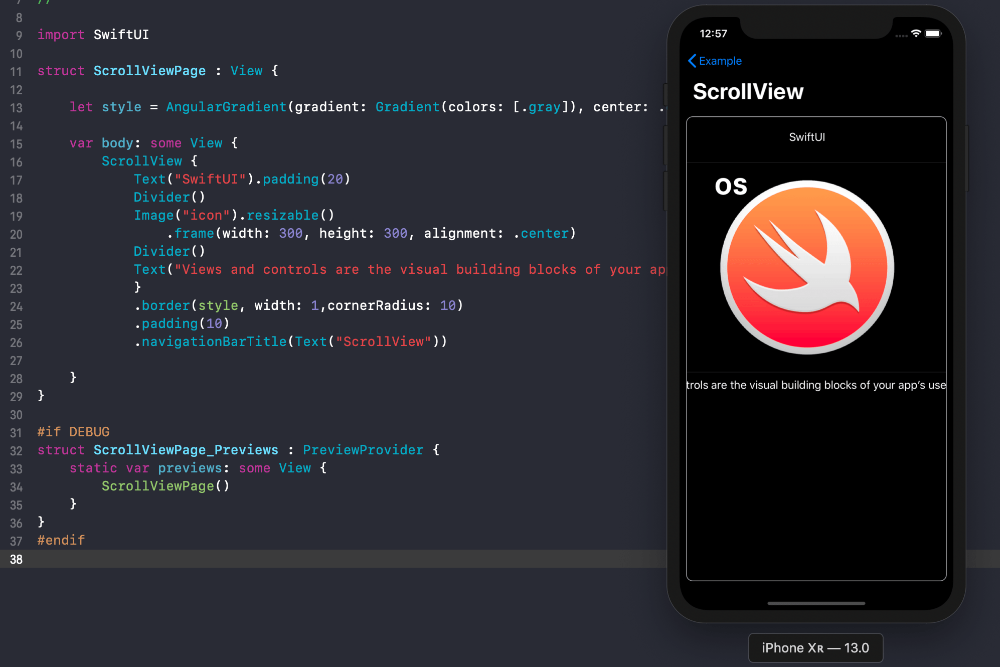
</details>

[🔝](#Layout_D)

<h4 id="ForEach"> ForEach </h4>

`ForEach` is used to present a view based on a collection of existing data.

Example:

```swift
let data = (0..<5)
var body: some View {
    ForEach(data) { e in
        Text("Hello \(e)")
            .bold()
            .font(.system(size: 25, design: .monospaced))
            .padding(5)
}
```

<details close>
  <summary>View running results</summary>
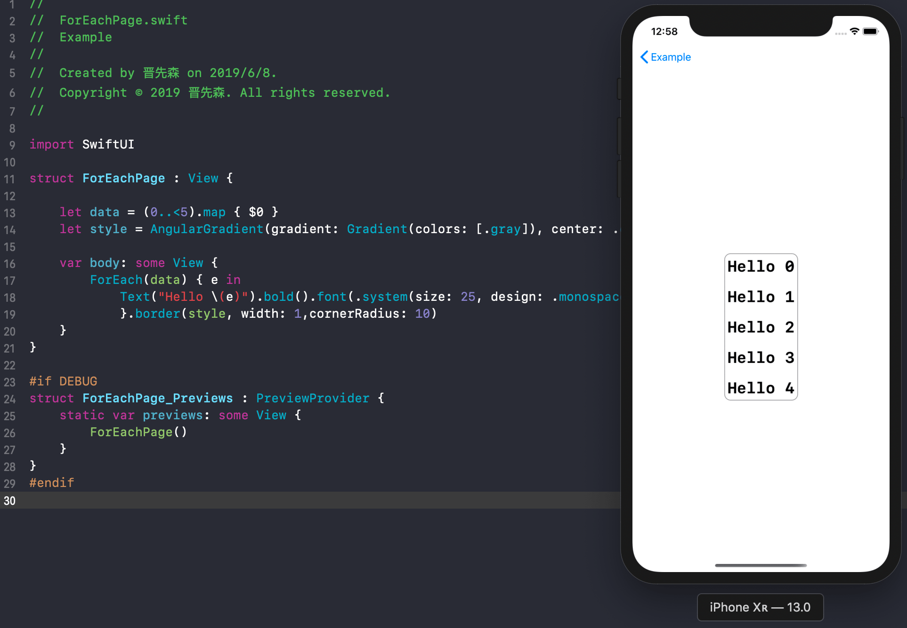
</details>

[🔝](#Layout_D)

<h4 id="Group"> Group </h4>

`Group` is used to aggregate multiple views, and the properties set on the Group will be applied to each child view.

Example:

```swift
Group {
    Text("Hello World !")
    Text("Hello World !")
    }
```

<details close>
  <summary>View running results</summary>
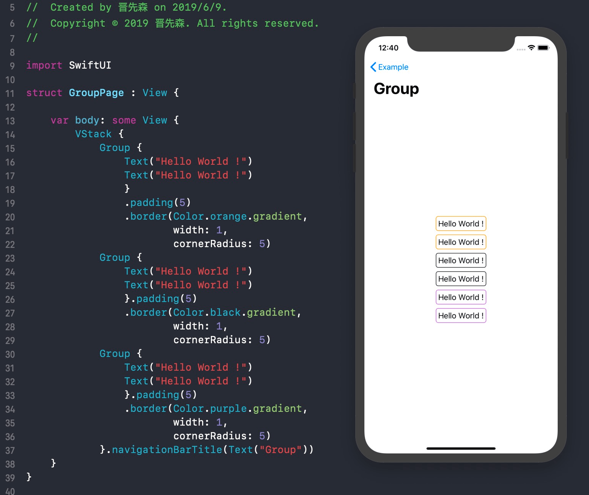
</details>

[🔝](#Layout_D)
 
<h4 id="GroupBox"> GroupBox </h4>

Waiting for release.


<h4 id="Section"> Section </h4>

`Section` is used to create the **header/footer** view content, which is generally used in conjunction with the `List` component.

Example:

```swift
Section(header: Text("I'm header"), footer: Text("I'm footer")) {
    ForEach(0..<3) {
        Text("Hello \($0)")
    }
}
```

<details close>
  <summary>View running results</summary>
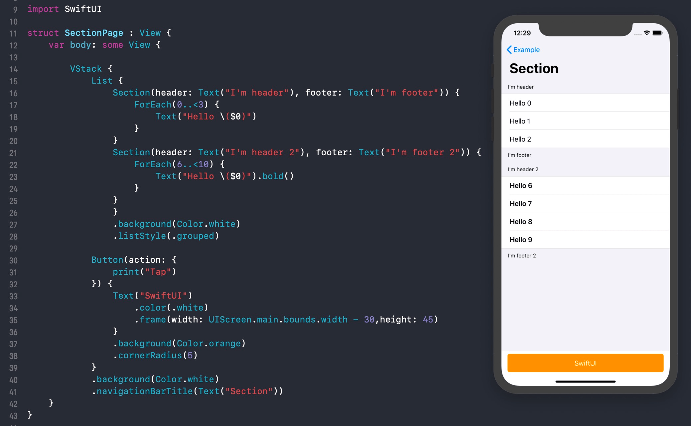
</details>

<h4 id="Form"> Form </h4>

`Form` A container for grouping controls used for data entry, such as in settings or inspectors.

Example:

```swift
Form {
   TextField("First Name", text: $firstName)
   TextField("Last Name", text: $lastName)
}
```

<details close>
  <summary>View running results</summary>
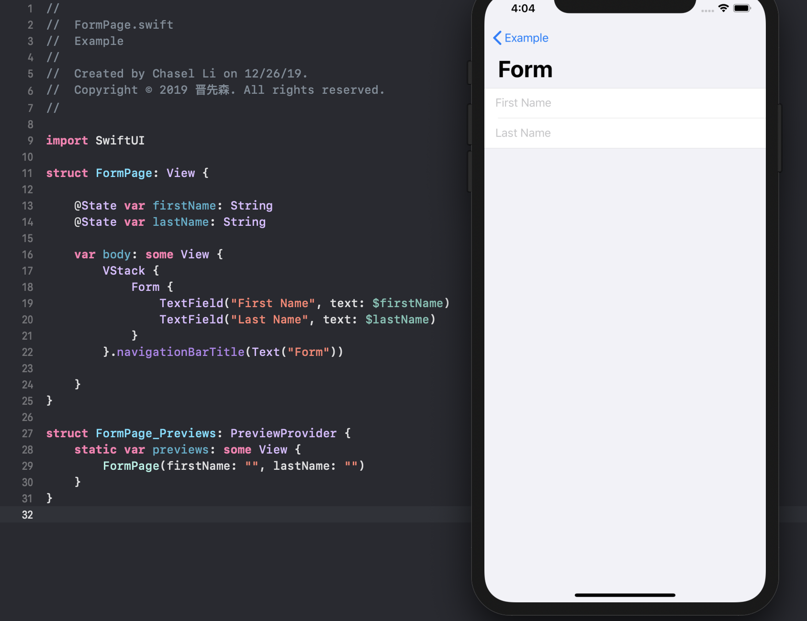
</details>

[🔝](#Layout_D)
 
<h4 id="NavigationView"> NavigationView </h4>

`NavigationView` is used to create a view container that contains the top navigation bar.

Example:

```swift
NavigationView {
            Text("🧚‍♂️🧚‍♀️🧜‍♂️🧜‍♀️🧞‍♂️🧞‍♀️").blur(radius: 5)
            Text("Swifter Swifter")
            .bold()
                .foregroundColor(.orange)
                .font(.largeTitle)
        }
    .navigationBarTitle(Text("NavigationView"))
```

<details close>
  <summary>View running results</summary>
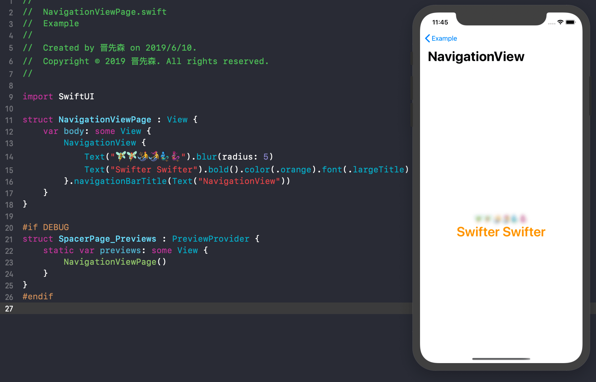
</details>

[🔝](#Layout_D)

<h4 id="TabView"> TabView </h4>

`TabView` is used to create a view container that contains the bottom ** TabBar**.

Example:

```swift
TabView(selection: $index) {
    ForEach(0..<imgs.count) { item in
        TabItemPage(index: item)
            .tabItem{
                Image(self.imgs[item])
                Text("\(item)")
        }
        .tag(item)
    }
}
```

<details close>
  <summary>View running results</summary>

</details>

[🔝](#Layout_D)

<h4 id="HSplitView"> HSplitView </h4> 

Waiting for release.

<h4 id="VSplitView"> VSplitView </h4> 

Waiting for release.

[🔝](#Layout_D)

<h4 id="Alert"> Alert </h4>

`Alert` is used to display a bullet reminder that needs to be associated with a trigger event.

Example:

```swift
alert(isPresented: $showAlert, content: {
            Alert(title: Text("确定要支付这100000000美元吗？"),
                  message: Text("请谨慎操作\n一旦确认，钱款将立即转入对方账户"),
                  primaryButton: .destructive(Text("确认")) { print("转出中...") },
                  secondaryButton: .cancel())
        }).navigationBarTitle(Text("Alert"))
```

<details close>
  <summary>View running results</summary>

</details>

[🔝](#Alert_D)


<h4 id="ActionSheet"> ActionSheet </h4>

`ActionSheet` is used to pop up a selection box.

Example:

```swift
ActionSheet(title: Text("Title"),
            message: Text("Message"),
            buttons:
    [.default(Text("Default"), onTrigger: {
        print("Default")
        self.showSheet = false
    }),.destructive(Text("destructive"), onTrigger: {
        print("destructive")
        self.showSheet = false
    }),.cancel({
        print("Cancel")
        self.showSheet = false
    })])
```

usage：
```swift 
.actionSheet(isPresented: $showSheet, content: {sheet})
```
<details close>
  <summary>View running results</summary>
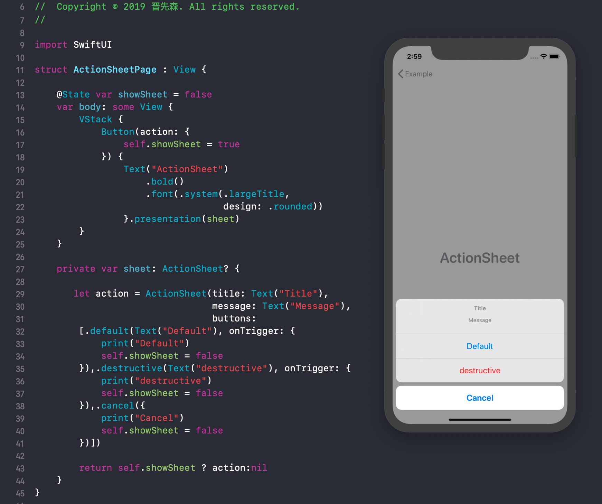
</details>

[🔝](#Alert_D)


<h4 id="Modal"> Modal </h4>

`Modal` is used to pop up a view.

Example:

```swift
Modal(Text("Modal View"),onDismiss: {
    print("View Dismiss !")
})
```

<details close>
  <summary>View running results</summary>
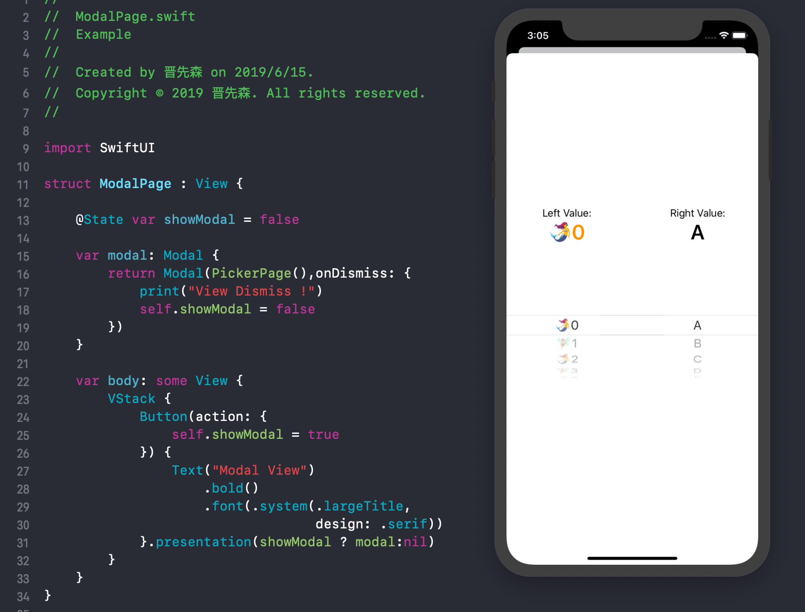
</details>

[🔝](#Alert_D)


<h4 id="Popover"> Popover </h4>

`Popover` is used to pop up a view, see the results below.

Example:

```swift
.popover(isPresented: $showPop, content: {
                ImagePage()
            })
```

<details close>
  <summary>View running results</summary>
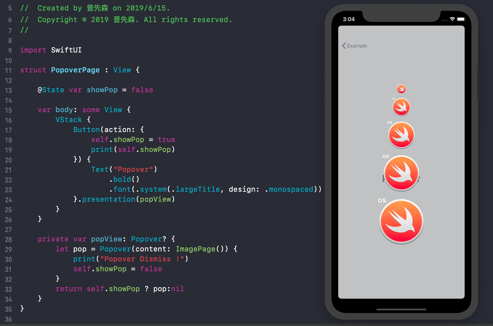
</details>

[🔝](#Alert_D)

## 📎 About

* The code involved in the above example is in this repository code. It is recommended to download and run the view.
* If you have better usage and suggestions about SwiftUI, look forward to sharing it!
* If there are omissions and errors in the examples in this article,  please create a [**Issue**](https://github.com/Jinxiansen/SwiftUI/issues/new) !
 


## ✉️ Contacts

email : hi@jinxiansen.com

微博 : [@晋先森](http://weibo.com/3205872327)

## 📄 License	

SwiftUI is released under the [MIT license](LICENSE). See LICENSE for details.

