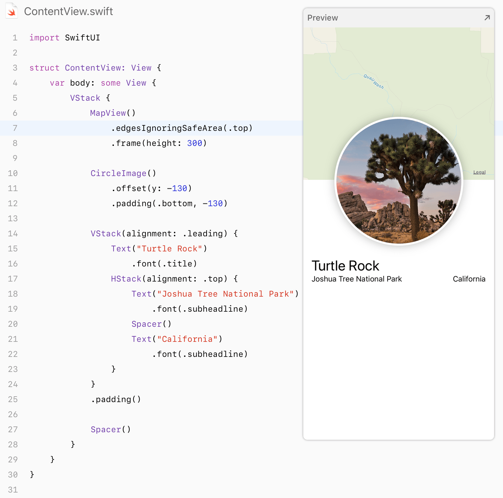
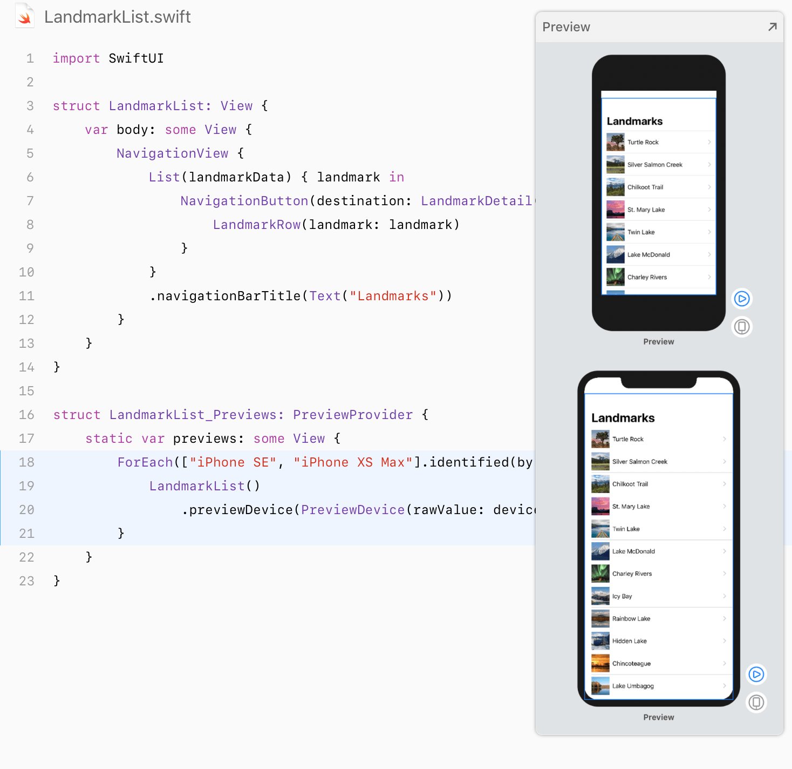
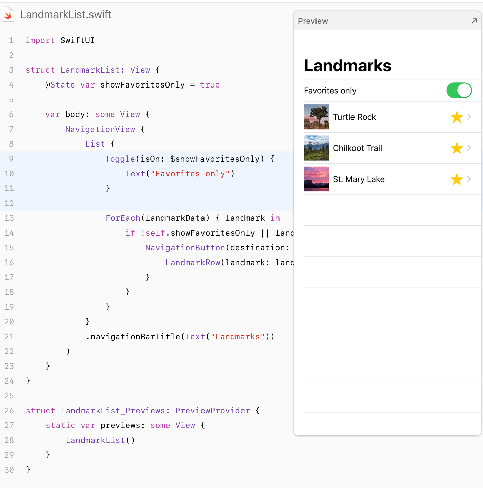
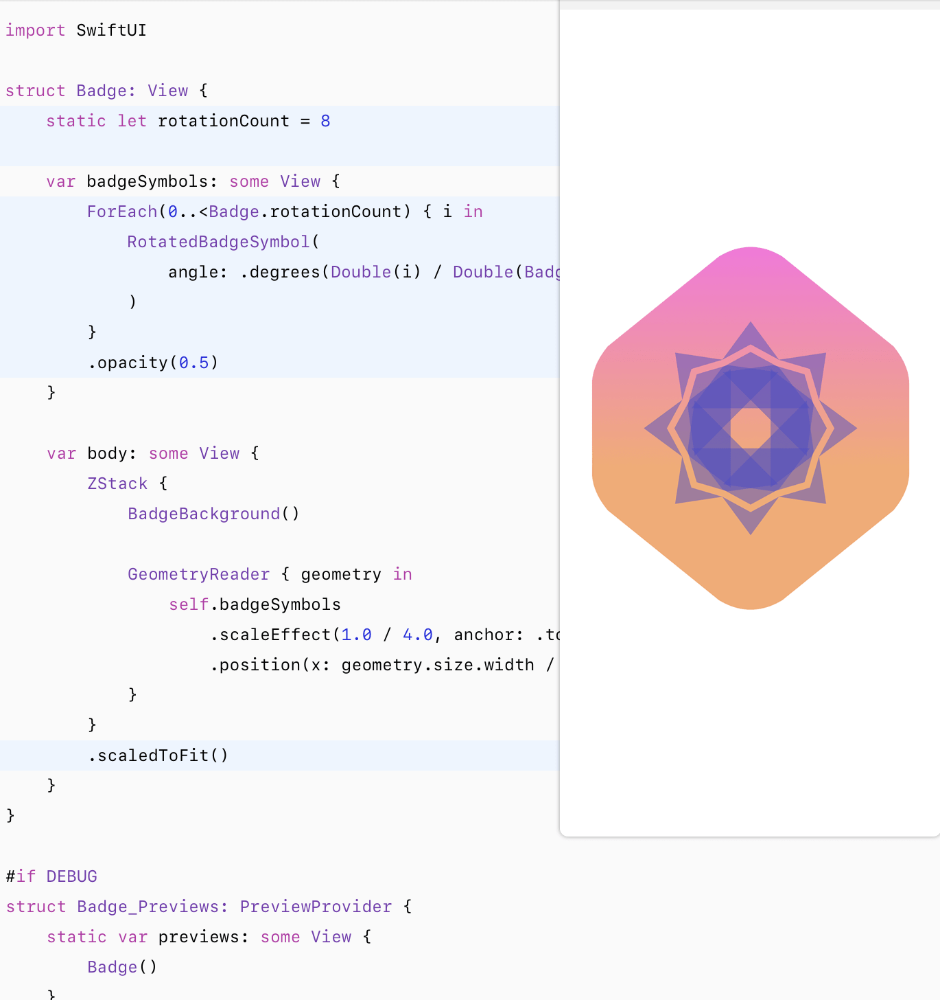
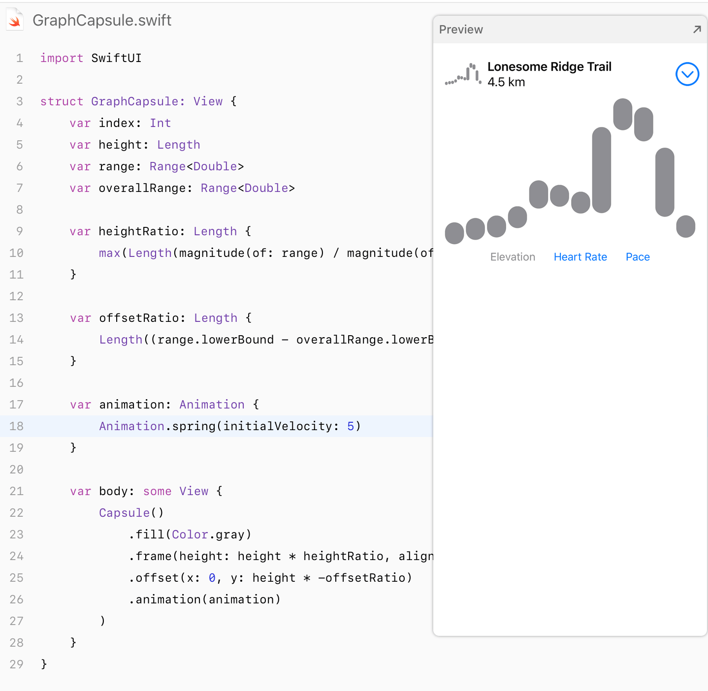
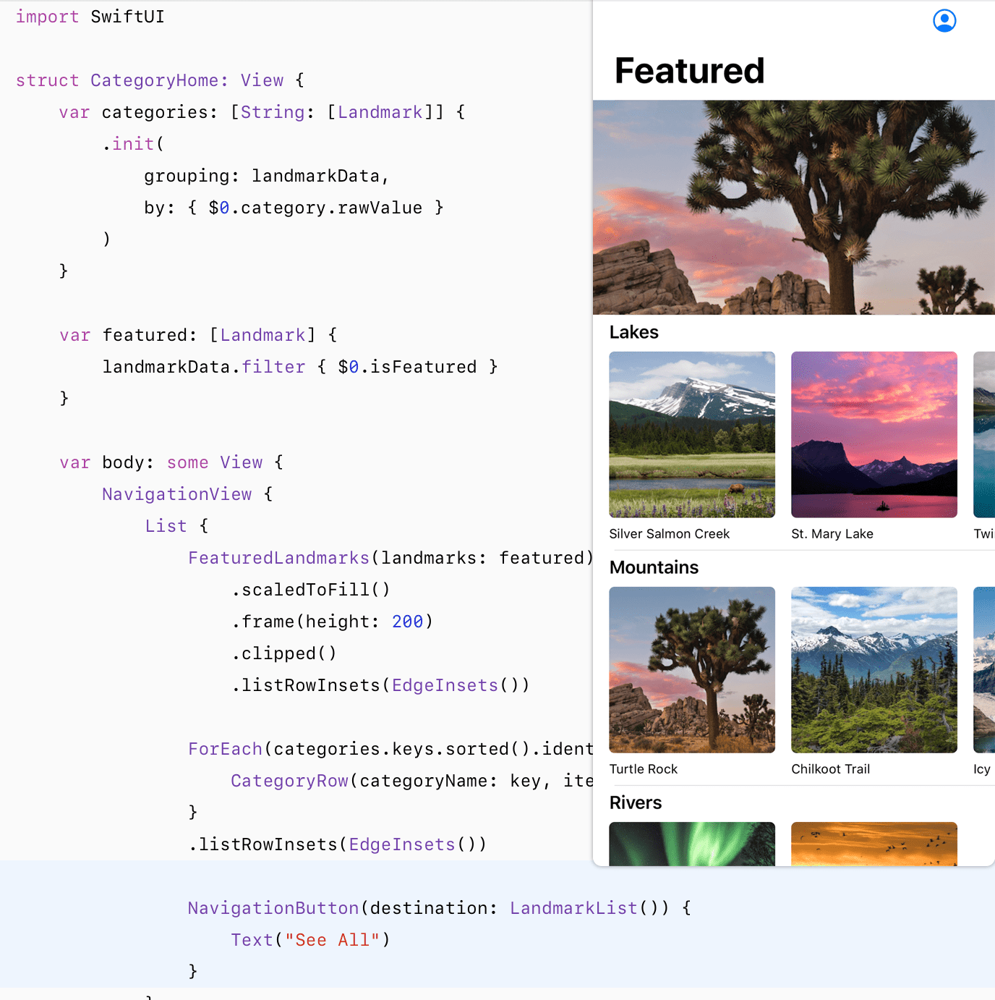
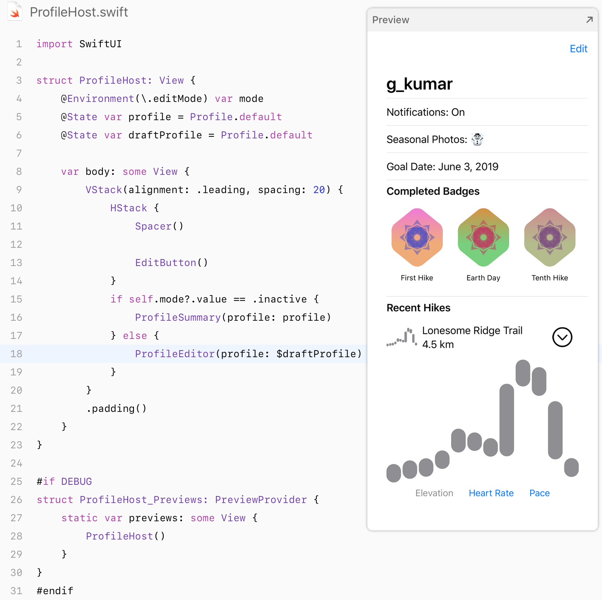
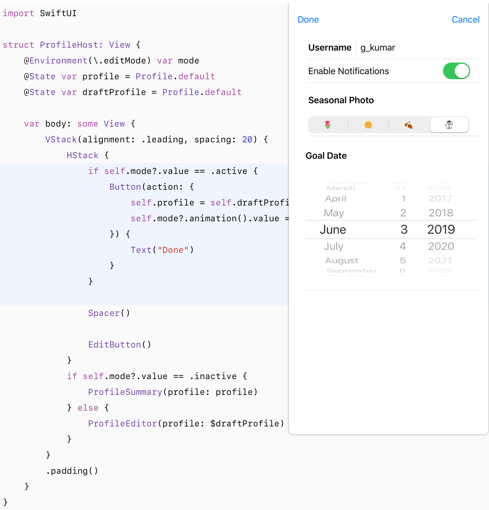
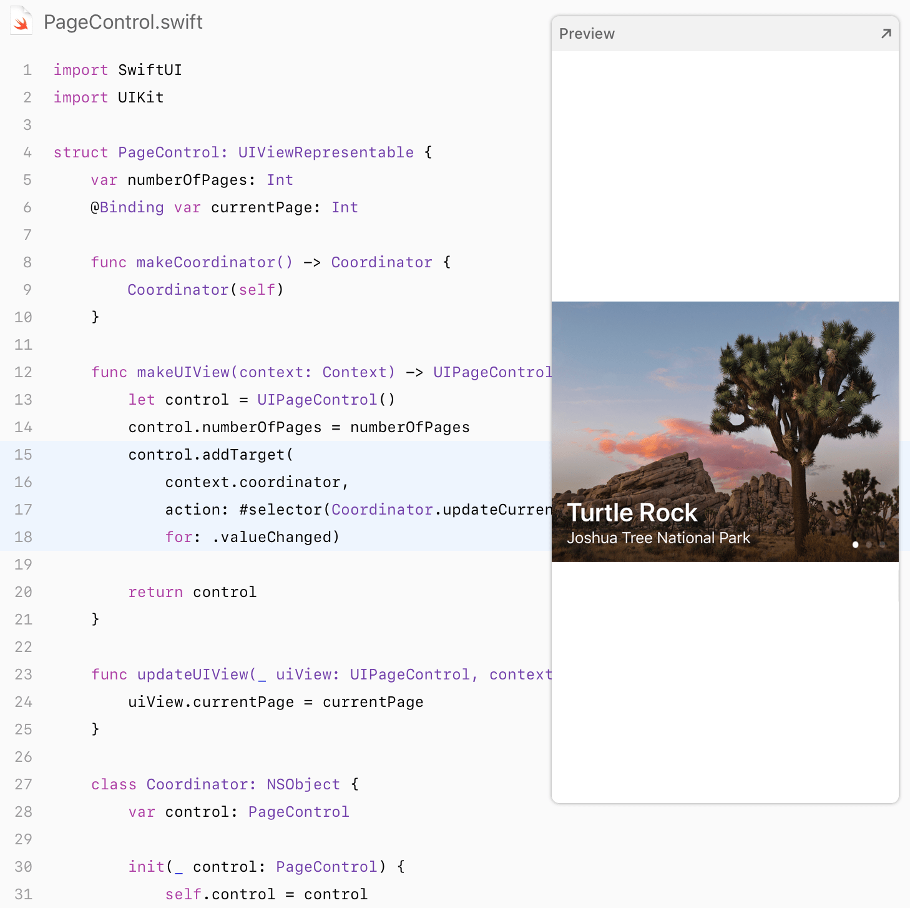

`SwiftUI` 是一种为 **Apple** 所有平台创建用户界面的现代化框架，以前所未有的速度创建漂亮，动态的应用程序。

这是关于今天 [**WWDC2019**](https://www.apple.com/ios/ios-13-preview/) 发布的 `SwiftUI` 布局框架的一些官方示例，希望对你了解和学习这门新布局框架有所帮助！

### SwiftUI Essentials

* 创建和组合视图

* 创建列表和导航栏

* 处理用户输入

### Drawing and Animation

* 绘图路径和形状

* 动画视图和过渡

### App Design and Layout

* 复杂界面组合

* 使用 **UIControls**

### Framework Integration

* 使用 **UIKit** 

更多信息，请访问 [官方站点:](https://developer.apple.com/tutorials/swiftui)

如果你有更好的参考示例，期待与我们分享，为开源而努力!

## Contacts

#### email : hi@jinxiansen.com
#### Sina : [@晋先森](http://weibo.com/3205872327)

## License	

SwiftUI is released under the [MIT license](LICENSE). See LICENSE for details.