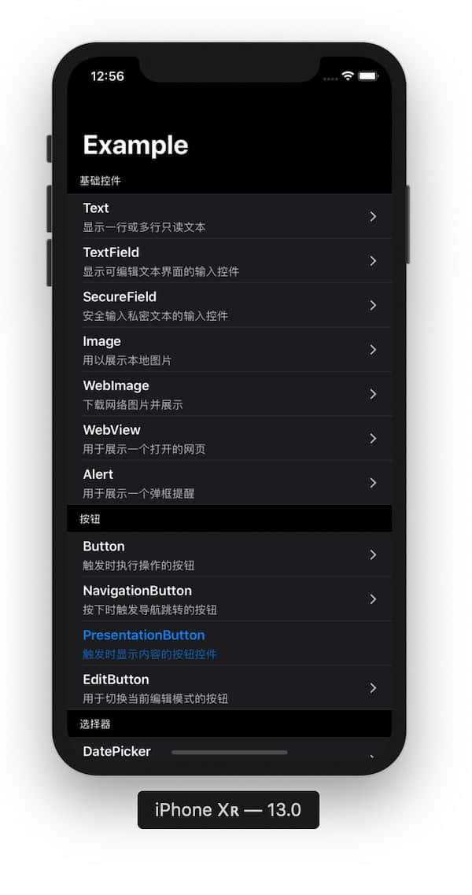
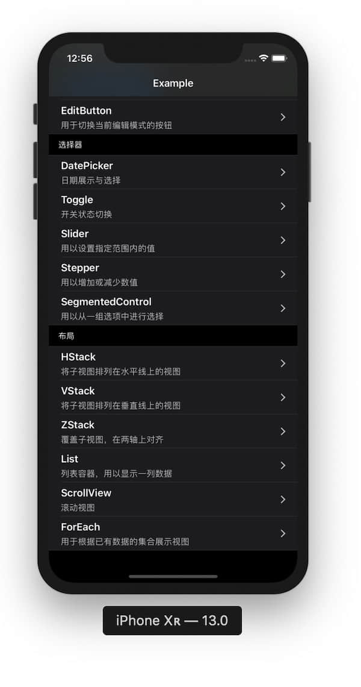

[](https://github.com/Jinxiansen/SwiftUI)
[](https://swift.org)
[](https://developer.apple.com/xcode)
[](https://developer.apple.com/macOS)
[](https://opensource.org/licenses/MIT)

本文参考 SwiftUI [官方示例](https://github.com/Jinxiansen/SwiftUI/tree/doc) 并将探索结果记录于此，希望能够对你有所帮助。 

对于本文所述内容，默认你已有一定的基于 Swift 语言的开发经验，故不会详细的叙述每个细节；如果对 Swift 语法有疑问，可先学习 [Swift](https://swift.org) 语法。


有关 `SwiftUI` 的疑问，可加入 SwiftUI QQ 交流群：**18552966** ，共同探讨。

[English 📔](README.md)

### [Whats New in SwiftUI?](https://developer.apple.com/xcode/swiftui/)


## 截图
|View|Layout|
|:---:|:---:|
|||

## 💻 所需环境

- macOS 15
- Xcode 11.0
- iOS 13.0


## 📂 目录：

### 基础控件

* <span id="Text_D">Text 文本</span>
	- [Text](#Text)
	- [TextField](#TextField)
	- [SecureField](#SecureField)

* <span id="Image_D">Image 图片</span>
	- [Image](#Image)
	- [WebImage](#WebImage)

* <span id="Button_D">Button 按钮</span>
	- [Button](#Button)
	- [PullDownButton](#PullDownButton)
	- [ItemBasedPopUpButton](#ItemBasedPopUpButton)
	- [NavigationButton](#NavigationButton)
	- [PresentationButton](#PresentationButton)
	- [EditButton](#EditButton)
	- [PasteButton](#PasteButton)

* <span id="Picker_D">Picker 选择器</span>
	- [Picker](#Picker)
	- [DatePicker](#DatePicker)
	- [Toggle](#Toggle)
	- [Slider](#Slider)
	- [Stepper](#Stepper)
	- [SegmentedControl](#SegmentedControl)

* <span id="Special_D">特殊视图</span>
	- [WebView](#WebView)
	- [UIViewController](#UIViewController)

### <span id="Layout_D">布局</span>
	
* <span id="Stacks_D">Stacks</span>
	- [HStack](#HStack)
	- [VStack](#VStack)
	- [ZStack](#ZStack)

* <span id="List_D">List 列表</span>
	- [List](#List)
	- [ScrollView](#ScrollView)
	- [ForEach](#ForEach)

* <span id="Container_D">Container Views 容器视图</span>
	- [Group](#Group)
	- [GroupBox](#GroupBox)
	- [Section](#Section)
  - [Form](#Form)

* <span id="Architectural_D">Architectural Views 导航、切换、排列</span>
	- [NavigationView](#NavigationView)
	- [TabView](#TabView)
	- [HSplitView](#HSplitView)
	- [VSplitView](#VSplitView)

* <span id="Alert_D">Alert 弹框、选择</span>
	- [Alert](#Alert)
	- [Modal](#Modal)
	- [Popover](#Popover)
	- [Sheet](#Sheet)
	- [ActionSheet](#ActionSheet)


### <span id="State_D">State and Data Flow 状态和数据流</span>

* <span id="Bindings_D"> Bindings </span>
	* [Binding](#Binding)
 
* <span id="Data_D"> Data-Dependent Views </span>
	* [State](#State)
	* [ObjectBinding](#ObjectBinding)
	* [EnvironmentObject](#EnvironmentObject)

* <span id="Environment_D"> Environment Values </span>
	* [Environment](#Environment)
	* [EnvironmentValues](#EnvironmentValues)

* <span id="ENavigation_D"> ENavigation Models </span>
	* [DynamicNavigationDestinationLink](#DynamicNavigationDestinationLink)

* <span id="Preferences_D"> Preferences </span>
	* [LocalizedStringKey](#LocalizedStringKey)

* <span id="Transactions_D"> Transactions </span>
	* [Transaction](#Transaction)


### 手势

* Basic Gestures 基本手势
	* [TapGesture](#TapGesture)
	* [LongPressGesture](#LongPressGesture)
	* [DragGesture](#DragGesture)
	* [MagnificationGesture](#MagnificationGesture)
	* [RotationGesture](#RotationGesture)

* Combined Gestures 合并手势
	* [SequenceGesture](#SequenceGesture)
	* [SimultaneousGesture](#SimultaneousGesture)
	* [ExclusiveGesture](#ExclusiveGesture)

* Custom Gestures 自定义手势
	* [AnyGesture](#AnyGesture)


<h2 id="基础控件">基础控件</h2>

<h4 id="Text">Text</h4>

`Text` 用来展示一行或多行的文本内容，效果等同于 `UILabel`，但更加优秀。
如果要创建 `Text`， 只需通过 `Text("SwiftUI")` 即可创建；
采用链式语法，也可以为文本添加多项属性，如字体、颜色、阴影、上左下右的间距等。

示例：

```swift
Text("SwiftUI")
    .foregroundColor(.orange)
    .bold()
    .font(.system(.largeTitle))
    .fontWeight(.medium)
    .italic()
    .shadow(color: .black, radius: 1, x: 0, y: 2)
```

<details close>
  <summary>查看运行效果</summary>
  
</details>
 
> HStack 和 VStack 控件用于承载多个视图，在后面会提到。

[🔝](#Text_D)

<h4 id="TextField"> TextField </h4>
 
`TextField` 用来添加普通的输入框，一般常用作文本输入。

示例：

```swift

TextField(self.$name, placeholder: self.nameText, onEditingChanged: { changed in
    print("onEditing: \(changed)")
}) {
    print("userName: \(self.name)")
    self.endEditing(true)
}}
.padding(10)
.frame(height: 50)
.textFieldStyle(RoundedBorderTextFieldStyle())
.padding(EdgeInsets(top: 0, leading: 20, bottom: 0, trailing: 20))
```

<details close>
  <summary>查看运行效果</summary>

</details>

[🔝](#Text_D)

<h4 id="SecureField"> SecureField </h4>

`SecureField ` 一般作为密码输入时使用，使用方式与 `TextField` 并无差别，示例与运行效果同上 `TextField`。


<h4 id="Image"> Image </h4>

`Image` 控件用于展示图片。

示例：

```swift
Image("icon")
    .resizable()
    .frame(width: 100,
           height: 100,
           alignment: .center)
```

<details close>
  <summary>查看运行效果</summary>

</details>

[🔝](#Text_D)

<h4 id="WebImage"> WebImage </h4>

`webImage` 用于下载网络图片，使用的 `URLSession`下载成功后替换原有 `Image`；你也可以在 `downloadWebImage ` 方法中使用 [Kingfisher](https://github.com/onevcat/Kingfisher) 。

示例：

```swift
var body: some View {
        Image(uiImage: self.uiImage ?? placeholderImage)
            .resizable()
            .onAppear(perform: downloadWebImage)
            .frame(width: 80,
                   height: 80,
                   alignment: .center)
            .onTapGesture {
                print("Tap ")
        }
    }
```

<details close>
  <summary>查看运行效果</summary>

</details>

[🔝](#Text_D)

<h4 id="Button"> Button </h4>

`Button` 用于响应点击事件。

示例：

```swift
Button(action: {
    print("Tap")
}) {
   Text("I'm a Button")
}
```

<h4 id="PullDownButton"> PullDownButton </h4>

尚未发布

<h4 id="ItemBasedPopUpButton"> ItemBasedPopUpButton </h4>

尚未发布


<h4 id="NavigationButton"> NavigationButton 已弃用</h4>

`NavigationButtonPage ` 用以 Push 到下一个导航页面。

示例：

```swift
NavigationLink(destination: NavigationButtonPage()) {
            Text("NavigationButton").bold()
                .foregroundColor(.orange)
                .font(.largeTitle)
            }
    .navigationBarTitle(Text("Page"))
```     

<details close>
  <summary>查看运行效果</summary>

</details>

[🔝](#Button_D)

<h4 id="PresentationButton" style='color:red'> PresentationButton </h4> 

`PresentationButton` ~~用以弹出一个页面。~~  已经弃用了，请使用 `NavigationLink`


[🔝](#Button_D)

<h4 id="EditButton"> EditButton </h4>

`EditButton` 用以触发编辑状态，使用时只需在 `navigationBarItems ` 设置即可。

示例：

```swift
navigationBarItems(trailing: EditButton())
```     

<details close>
  <summary>查看运行效果</summary>

</details>

[🔝](#Button_D)

<h4 id="PasteButton"> PasteButton </h4> 

尚未发布


<h4 id="Picker"> Picker </h4>

`Picker` 可自定义数据源的选择器。

示例:

```swift
Picker(selection: $leftIndex, label: Text("Picker")) {
    ForEach(0..<leftSource.count) {
        Text(self.leftSource[$0]).tag($0)
    }
    }.frame(width: UIScreen.main.bounds.width/2)
```     

<details close>
  <summary>查看运行效果</summary>

</details>
 
[🔝](#Picker_D)

<h4 id="DatePicker"> DatePicker </h4>

`DatePicker` 用于选择绝对日期的控件。

示例：

```swift
DatePicker(selection: $server.date, 
                in: server.spaceDate, 
                displayedComponents: .date, label: {
                    Text("")
                })
```     

<details close>
  <summary>查看运行效果</summary>

</details>

[🔝](#Picker_D)

<h4 id="Toggle"> Toggle </h4>

`Toggle` 用于切换选中状态。

示例：

```swift
Toggle(isOn: $isOn) {
    Text("State: \(self.isOn == true ? "开":"关")")
}.padding(20)
```     

<details close>
  <summary>查看运行效果</summary>

</details>

[🔝](#Picker_D)
 
<h4 id="Slider"> Slider </h4>

`Slider ` 用于从有限值范围中选值的控件。

示例：

```swift
Slider(value: $data.rating)
```     

<details close>
  <summary>查看运行效果</summary>

</details>
 
 [🔝](#Picker_D)

<h4 id="Stepper"> Stepper </h4>

`Stepper ` 用以增加或减少数值。

示例：

```swift
Stepper(value: $value, step: 2, onEditingChanged: { c in
    print(c)
}) {
    Text("Stepper Value: \(self.value)")
    }.padding(50)
```

<details close>
  <summary>查看运行效果</summary>

</details>

[🔝](#Picker_D)

<h4 id="SegmentedControl" style="color:red">SegmentedControl 已经弃用了</h4>


~~`SegmentedControl` 用以分段条件选择。~~

示例：

```swift
SegmentedControl(selection: $currentIndex) {
    ForEach(0..<items.count) { index in
        Text(self.items[index]).tag(index)
    }
    }.tapAction {
        print("currentIndex: \(self.currentIndex)")
}
```

<details close>
  <summary>查看完整示例及运行效果</summary>

</details>

[🔝](#Picker_D)
 

<h4 id="WebView"> WebView </h4>

`WebView` 用于展示一个打开的网页。

示例:

```swift
struct WebViewPage : UIViewRepresentable {
    func makeUIView(context: Context) -> WKWebView  {
        return WKWebView()
    }
    func updateUIView(_ uiView: WKWebView, context: Context) {
        let req = URLRequest(url: URL(string: "https://www.apple.com")!)
        uiView.load(req)
    }
}
```

<details close>
  <summary>查看运行效果</summary>

</details>

[🔝](#Special_D)

 
<h4 id="UIViewController"> UIViewController </h4>

`UIViewController ` 用于展示在 **SwiftUI** 中打开 **UIKit** 的 **UIViewController** ，并且在 **UIViewController** 中打开 `SwiftUI` View。

示例:

先定义：

```swift
struct ControllerPage<T: UIViewController> : UIViewControllerRepresentable {
    
    typealias UIViewControllerType = UIViewController
    
    func makeUIViewController(context: UIViewControllerRepresentableContext<ControllerPage>) -> UIViewController {
        return T()
    }
    
    func updateUIViewController(_ uiViewController: UIViewController, context: UIViewControllerRepresentableContext<ControllerPage>) {
        debugPrint("\(#function)：\(type(of: T.self))")
    }
    
}
```

然后调用：

```swift
NavigationButton(destination: ControllerPage<UIKitController>()) {
    PageRow(title: "UIViewController",subTitle: "打开 UIViewController")

}
```

<details close>
  <summary>查看运行效果</summary>


</details>

[🔝](#Special_D)

### 布局 

<h4 id="HStack"> HStack </h4>

`HStack` 用于将子视图排列在水平线上的视图。

示例:

```swift
HStack {
    Text("made in China.")
    Divider() // Just add a line.
    Text("the People's Republic Of China.")
}
```

<details close>
  <summary>查看运行效果</summary>

</details>

[🔝](#Layout_D)

<h4 id="VStack"> VStack </h4>

`VStack` 用于将子视图排列在垂直线上的视图。

示例:

```swift
VStack {
    Text("made in China.")
    Divider() // Just add a line.
    Text("the People's Republic Of China.")
}
```

<details close>
  <summary>查看运行效果</summary>

</details>

[🔝](#Layout_D)
 
<h4 id="ZStack"> ZStack </h4>

`ZStack` 用于覆盖子视图，在两轴上对齐。

示例:

```swift
ZStack {
    Text("made in China.")
    Divider() // Just add a line.
    Text("the People's Republic Of China.")
}
```

<details close>
  <summary>查看运行效果</summary>

</details>

[🔝](#Layout_D)

<h4 id="List"> List </h4>

`List` 列表容器，用以显示一列数据。

示例:

```swift
List(0..<5) { item in
    Text("Hello World !")
}.navigationBarTitle(Text("List"), displayMode: .large)
```

<details close>
  <summary>查看运行效果</summary>

</details>

[🔝](#Layout_D)

<h4 id="ScrollView"> ScrollView </h4>

`ScrollView` 是一个滚动视图容器。

示例:

```swift
ScrollView {
    Text("SwiftUI").padding(20)
    Divider()
    Image("icon").resizable()
        .frame(width: 300, height: 300, alignment: .center)
    Divider()
    Text("Views and ... user interface.")
    }
    .border(Color.gray.gradient, width: 1)
            .cornerRadius(10)
            .padding(10)
            .navigationBarTitle(Text("ScrollView"))
```

<details close>
  <summary>查看运行效果</summary>

</details>

[🔝](#Layout_D)

<h4 id="ForEach"> ForEach </h4>

`ForEach` 用于根据已有数据的集合展示视图。

示例:

```swift
let data = (0..<5)
var body: some View {
    ForEach(data) { e in
        Text("Hello \(e)")
            .bold()
            .font(.system(size: 25, design: .monospaced))
            .padding(5)
}
```

<details close>
  <summary>查看运行效果</summary>

</details>

[🔝](#Layout_D)

<h4 id="Group"> Group </h4>

`Group` 用于集合多个视图，对 Group 设置的属性，将作用于每个子视图。

示例:

```swift
Group {
    Text("Hello World !")
    Text("Hello World !")
    }
```

<details close>
  <summary>查看运行效果</summary>

</details>

[🔝](#Layout_D)

<h4 id="GroupBox"> GroupBox </h4>

尚未发布


<h4 id="Section"> Section </h4>

`Section` 用于创建带头/尾部的视图内容，一般结合 `List` 组件使用。

示例:

```swift
Section(header: Text("I'm header"), footer: Text("I'm footer")) {
    ForEach(0..<3) {
        Text("Hello \($0)")
    }
}
```

<details close>
  <summary>查看运行效果</summary>

</details>

<h4 id="Form"> Form </h4>

`Form` 是对一组数据输入进行控制的容器。

Example:

```swift
Form {
   TextField("First Name", text: $firstName)
   TextField("Last Name", text: $lastName)
}
```

<details close>
  <summary>查看运行效果</summary>

</details>

[🔝](#Layout_D)

<h4 id="NavigationView"> NavigationView </h4>

`NavigationView` 用于创建包含顶部导航栏的视图容器。

示例:

```swift
NavigationView {
            Text("🧚‍♂️🧚‍♀️🧜‍♂️🧜‍♀️🧞‍♂️🧞‍♀️").blur(radius: 5)
            Text("Swifter Swifter")
            .bold()
                .foregroundColor(.orange)
                .font(.largeTitle)
        }
    .navigationBarTitle(Text("NavigationView"))
```

<details close>
  <summary>查看运行效果</summary>

</details>

[🔝](#Layout_D)

<h4 id="TabView"> TabView </h4>

`TabView` 用于创建包含底部 ** TabBar** 的视图容器。

示例:

```swift
TabView(selection: $index) {
    ForEach(0..<imgs.count) { item in
        TabItemPage(index: item)
            .tabItem{
                Image(self.imgs[item])
                Text("\(item)")
        }
        .tag(item)
    }
}
```

<details close>
  <summary>查看运行效果</summary>

</details>

[🔝](#Layout_D)

<h4 id="HSplitView"> HSplitView </h4> 

尚未发布

<h4 id="VSplitView"> VSplitView </h4> 

尚未发布


<h4 id="Alert"> Alert </h4>

`Alert` 用于展示一个弹框提醒，需要与点击事件关联起来。

示例:

```swift
alert(isPresented: $showAlert, content: {
            Alert(title: Text("确定要支付这100000000美元吗？"),
                  message: Text("请谨慎操作\n一旦确认，钱款将立即转入对方账户"),
                  primaryButton: .destructive(Text("确认")) { print("转出中...") },
                  secondaryButton: .cancel())
        }).navigationBarTitle(Text("Alert"))
```

<details close>
  <summary>查看运行效果</summary>

</details>

[🔝](#Alert_D)


<h4 id="ActionSheet"> ActionSheet </h4>

`ActionSheet` 用于弹出一个选择框。

示例:

```swift
ActionSheet(title: Text("Title"),
            message: Text("Message"),
            buttons:
    [.default(Text("Default"), onTrigger: {
        print("Default")
        self.showSheet = false
    }),.destructive(Text("destructive"), onTrigger: {
        print("destructive")
        self.showSheet = false
    }),.cancel({
        print("Cancel")
        self.showSheet = false
    })])
```

使用：
```swift 
.actionSheet(isPresented: $showSheet, content: {sheet})
```

<details close>
  <summary>查看运行效果</summary>

</details>

[🔝](#Alert_D)


<h4 id="Modal"> Modal </h4>

`Modal` 用于弹出一个视图。

示例:

```swift
Modal(Text("Modal View"),onDismiss: {
    print("View Dismiss !")
})
```

<details close>
  <summary>查看运行效果</summary>

</details>

[🔝](#Alert_D)


<h4 id="Popover"> Popover </h4>

`Popover` 用于弹出一个视图，样式见下方运行结果。

示例:

```swift
.popover(isPresented: $showPop, content: {
                ImagePage()
            })
```

<details close>
  <summary>查看运行效果</summary>

</details>

[🔝](#Alert_D)


## 📎 About

* 以上示例中所涉及代码，皆在本仓库代码中，建议下载并运行查看。
* 如果有关于 SwiftUI 更好的用法与建议，期待能够一起分享！
* 如果本文示例内容有疏漏和错误之处，欢迎提 [**Issue**](https://github.com/Jinxiansen/SwiftUI/issues/new) ！


## ✉️ Contacts

email : hi@jinxiansen.com

微博 : [@晋先森](http://weibo.com/3205872327)


## 📄 License	


SwiftUI is released under the [MIT license](LICENSE). See LICENSE for details.

